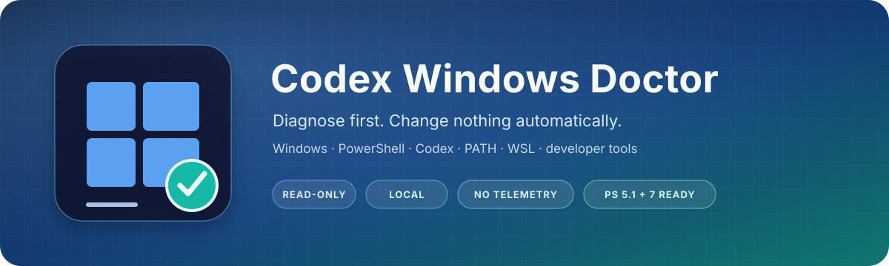

<p align="center">
  
</p>

<h1 align="center">Codex Windows Doctor</h1>

<p align="center"><strong>Read-only diagnostics for Windows, PowerShell, Codex, PATH, WSL, and the developer tools around them.</strong></p>

<p align="center">
  <a href="https://github.com/cuijialin8888-code/codex-win-doctor/actions/workflows/ci.yml"></a>
  <a href="https://github.com/cuijialin8888-code/codex-win-doctor/releases"></a>
  <a href="https://learn.microsoft.com/powershell/"></a>
  <a href="LICENSE"></a>
  <a href="https://github.com/cuijialin8888-code/codex-win-doctor/stargazers"></a>
</p>

<p align="center">
  <a href="#quick-start">Quick start</a> ·
  <a href="#what-it-checks">Checks</a> ·
  <a href="#privacy-and-safety">Safety</a> ·
  <a href="README.zh-CN.md">中文</a>
</p>

Codex behaving strangely on Windows? Codex Windows Doctor is a read-only diagnostic tool for your Windows, PowerShell, Codex, PATH, WSL, and related developer environment. It shows what is healthy, suspicious, or actually broken—and what to check next.

It is an unofficial diagnostics and troubleshooting toolkit for OpenAI Codex on Windows.

**This project is an independent community project and is not affiliated with or endorsed by OpenAI.**

[中文说明](README.zh-CN.md)

| Diagnose before changing | Safe to run | Useful evidence |
| --- | --- | --- |
| Separates missing, broken, conflicting, and optional tools | Local, no telemetry, no elevation, no automatic fixes | Console, JSON, and reviewable Markdown reports |

### It can help when...

- `codex`, `pwsh`, or `rg` resolves to the wrong executable or cannot run.
- PATH contains conflicting installations, shims, duplicates, or missing entries.
- A script expects Unix `unzip`, while Windows provides `tar.exe` or `Expand-Archive` instead.
- Codex Desktop, WSL, or `CODEX_HOME` appears present but behaves unexpectedly.
- You want a safe diagnostic report before changing your system.

### Safe by default

- Read-only diagnostics that run locally.
- No telemetry and no OpenAI API key required.
- No automatic PATH, registry, WSL, or AppX/MSIX changes.

The public CI currently exercises both Windows PowerShell 5.1 and PowerShell 7, including syntax validation, tests, static analysis, and report smoke tests.

## Quick start

### Option A — Clone with Git

```powershell
git clone https://github.com/cuijialin8888-code/codex-win-doctor.git
cd codex-win-doctor
.\codex-doctor.ps1
```

### Option B — Download the release

[Open the latest release](https://github.com/cuijialin8888-code/codex-win-doctor/releases/latest), download its ZIP asset, and extract it. Open PowerShell in the extracted versioned folder, then run:

```powershell
cd .\codex-win-doctor-*
.\codex-doctor.ps1
```

## Example output

This is an abridged example; counts and findings depend on the machine.

```text
Codex Windows Doctor 0.1.0

Environment
  Windows:      Windows 11 25H2 (build 26200, X64)
  PowerShell:   7.x (Core)
  Architecture: process x64

Checks
  [PASS] Codex CLI is executable
  [WARN] Multiple PowerShell 7 (pwsh) commands were detected
  [INFO] Unix unzip is absent, but a Windows-native ZIP capability is available
  [PASS] Workspace is writable and the probe was cleaned up

Summary
  PASS: 9  WARN: 1  FAIL: 0  INFO: 2  UNKNOWN: 0
  Overall: HEALTHY WITH WARNINGS
```

If the doctor does not recognize your Windows/Codex problem, run `.\codex-doctor.ps1 -IssueReport`, review the output, and open a [Diagnostic help request](https://github.com/cuijialin8888-code/codex-win-doctor/issues/new/choose). The tool never creates or uploads an issue for you.

## What it checks

| Area | Diagnostics |
| --- | --- |
| Windows | Version, edition, build, OS/process architecture, long-path setting |
| PowerShell | Version, executable, execution policy, `pwsh`/`powershell` resolution and smoke tests |
| Codex CLI | Resolution path, `codex --version`, execution capability, competing install locations |
| Codex desktop | Current-user AppX/MSIX package metadata and package status |
| Developer tools | Git, optional GitHub CLI, Node.js, npm, Python, `py`, pip, ripgrep |
| Archives | `unzip`, `tar.exe`, and `Expand-Archive` as distinct capabilities |
| Codex state | `CODEX_HOME`, default `.codex` directory, path conflicts, disposable write probe |
| Filesystem | Workspace and temporary-directory write/delete probes |
| PATH | Duplicate/missing entries, command conflicts, and shell shims |
| WSL | `wsl.exe`, status, and installed distributions without installing or changing WSL |

## Requirements

- Windows 10 or Windows 11
- PowerShell 7+ preferred, or Windows PowerShell 5.1
- No Python or Node.js runtime is required
- Administrator rights are not required for normal diagnostics

If execution policy blocks the script, review it first, then use a one-process override rather than changing machine policy:

```powershell
powershell.exe -NoProfile -ExecutionPolicy Bypass -File .\codex-doctor.ps1
```

Organization-managed policy can override process settings. See [PowerShell command resolution](docs/troubleshooting/powershell-command-resolution.md) before changing any policy.

## Privacy and safety

The trust promises above apply to every normal run: `codex-doctor.ps1` makes no network requests; it does not read authentication/configuration contents or upload API keys and tokens; every built-in renderer redacts user-profile paths and secret-like values. Disposable write probes are deleted immediately and cleanup is tested.

Redaction recognizes common secret names, every documented GitHub token prefix family, bearer headers, API-key query parameters, JWT-like strings, and OpenAI-style secret prefixes. It is defense in depth, not a guarantee: **always review a report before posting it publicly**.

See [SECURITY.md](SECURITY.md) for the security policy. Before sharing a report, follow the [report review guide](docs/troubleshooting/report-review.md).

## JSON reports

`-Json` returns one JSON object with tool metadata, timestamp, platform data, checks, summary counts, overall health, recommended next steps, and privacy metadata.

```powershell
$report = .\codex-doctor.ps1 -Json | ConvertFrom-Json
$report.checks | Where-Object status -In WARN, FAIL, UNKNOWN
```

An `.json` output extension selects JSON automatically:

```powershell
.\codex-doctor.ps1 -Output .\report.json
```

For CI systems that consume code-scanning artifacts, `-Sarif` emits SARIF
2.1.0. It contains non-PASS checks as findings, preserves the redacted
recommendations, and marks the invocation as read-only:

```powershell
.\codex-doctor.ps1 -Sarif -Output .\doctor.sarif
```

## Automation gates

By default, the doctor reports its observations and exits with code `0`. Use `-FailOn` only when a script or CI job needs a deliberately chosen policy gate:

```powershell
# Exit 1 only for confirmed FAIL checks; JSON remains available on standard output.
.\codex-doctor.ps1 -Json -FailOn Fail

# Gate on WARN or FAIL, or treat UNKNOWN as requiring review too.
.\codex-doctor.ps1 -Json -FailOn Warn
.\codex-doctor.ps1 -Json -FailOn Unknown
```

`Fail` selects `FAIL`; `Warn` selects `WARN` and `FAIL`; `Unknown` selects `UNKNOWN`, `WARN`, and `FAIL`; `None` is the default. A triggered gate writes one redacted summary to standard error and returns exit code `1`. It still does not execute project commands or repair Windows settings.

## Issue reports

`-IssueReport` creates Markdown that can be reviewed and pasted into a GitHub issue. It does not open an issue, log in to GitHub, or send data.

```powershell
.\codex-doctor.ps1 -IssueReport
.\codex-doctor.ps1 -IssueReport -Output .\doctor-report.md
```

For an interpretation question, choose [Diagnostic help request](https://github.com/cuijialin8888-code/codex-win-doctor/issues/new/choose). For a reproducible problem in this tool, choose Bug report. Never post API keys, tokens, cookies, credentials, or unreviewed authentication files.

## Troubleshooting guides

- [PowerShell command resolution](docs/troubleshooting/powershell-command-resolution.md)
- [Codex CLI not found](docs/troubleshooting/codex-cli-not-found.md)
- [Multiple Codex installations](docs/troubleshooting/multiple-codex-installations.md)
- [Archive tools on Windows](docs/troubleshooting/archive-tools.md)
- [WSL diagnostics](docs/troubleshooting/wsl-diagnostics.md)
- [ripgrep resolves but returns Access Denied](docs/troubleshooting/rg-access-denied.md)
- [Codex desktop package state](docs/troubleshooting/codex-desktop-package.md)
- [CODEX_HOME diagnostics](docs/troubleshooting/codex-home.md)
- [Report review and safe sharing](docs/troubleshooting/report-review.md)

## Roadmap

- **v0.1:** Windows environment diagnostics, privacy-safe reports, tests, and CI
- **v0.2:** Expanded Codex desktop and WSL interpretation, driven by verified cases
- **v0.3:** Safe, explicit guided remediation with rollback notes
- **Future:** Community-contributed checks, an optional support bundle, and better issue matching

Only v0.1 features are implemented today. The project intentionally does not include a GUI, background service, telemetry, elevation, automatic PATH/registry/package changes, automatic issue creation, or an OpenAI API dependency.

## Contributing

Bug reports, diagnostic edge cases, documentation fixes, and narrowly scoped checks are welcome. Please read [CONTRIBUTING.md](CONTRIBUTING.md), the [Code of Conduct](CODE_OF_CONDUCT.md), and the [security policy](SECURITY.md).

Maintainers can use the [maintenance checklist](docs/maintenance.md) for compatibility reviews and releases.

## Disclaimer

This project is an independent community project and is not affiliated with or endorsed by OpenAI. “OpenAI” and “Codex” are used only to describe compatibility and the environment being diagnosed. Verify recommendations against current official documentation before changing a managed or production system.

## License

[MIT](LICENSE) © 2026 cuijialin8888-code
